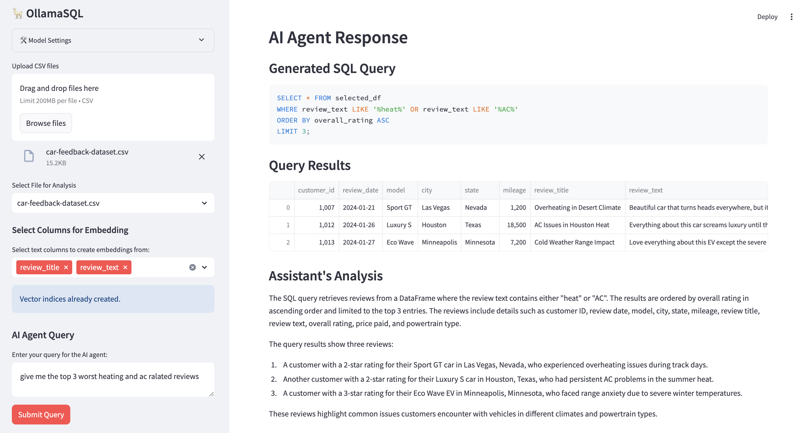

# 🦙 OllamaSQL: AI-Powered CSV Analysis

A Streamlit application that demonstrates the power of Large Language Models (LLMs) for data analysis by combining Ollama's tool calling capabilities with DuckDB for SQL query execution. Users can upload CSV files and interact with an AI agent using natural language to analyze their data.



## 🌟 Key Features

- Upload and analyze multiple CSV files
- Natural language to SQL query conversion using LLMs
- Interactive data visualization
- Support for multiple Ollama models
- Real-time SQL query execution with DuckDB
- Clean and intuitive user interface

## 🧠 How It Works

### Ollama Integration 🤖

The application uses the `ollama` Python library to interact with locally running Ollama models. Here's how it works:

```python
client = ollama.AsyncClient()
response = await client.chat(
    model=model_name,
    messages=messages,
    options={"temperature": temperature},
    format='json',
    tools=[...] # Tool definitions
)
```

### Function Calling with Ollama 🛠️

The app defines SQL execution as a tool that the LLM can use:

```python
tools=[{
    'type': 'function',
    'function': {
        'name': 'execute_sql_query',
        'description': 'Execute SQL query against the selected dataframe',
        'parameters': {
            'type': 'object',
            'properties': {
                'query': {
                    'type': 'string',
                    'description': 'SQL query to execute'
                }
            },
            'required': ['query']
        }
    }
}]
```

When the model decides to use the tool, it returns a `tool_calls` object in its response. The app detects this and executes the SQL query:

```python
if tool_calls := response['message'].get('tool_calls'):
    for tool in tool_calls:
        if tool['function']['name'] == 'execute_sql_query':
            query_args = tool['function']['arguments']
            # Execute the SQL query...
```

### DuckDB Integration 🦆

DuckDB is used as an in-memory SQL engine to execute queries on CSV data. The app registers pandas DataFrames with DuckDB:

```python
with duckdb.connect() as conn:
    conn.register('selected_df', dataframe)
    result = conn.execute(sql_query).df()
```

This allows for fast SQL queries without needing a separate database server!

### Streamlit Optimization 🚀

The app uses Streamlit's session state to maintain data between reruns:

```python
if 'uploaded_files' not in st.session_state:
    st.session_state['uploaded_files'] = {}
```

Key optimizations include:
- Caching uploaded CSV files in session state
- Using tabs for efficient file viewing
- Async operations for AI responses
- Lazy loading of dataframes

## 🛠️ Technologies Used

- **Streamlit**: Web application framework
- **Ollama**: Local LLM deployment and inference
- **DuckDB**: In-memory SQL query engine
- **Pandas**: Data manipulation and analysis
- **Python 3.8+**: Core programming language

## 📋 Prerequisites

1. Python 3.8 or higher
2. Ollama installed and running locally
3. At least one Ollama model [supporting tool-calling](https://ollama.com/search?c=tools) downloaded.

## 🚀 Installation

1. Clone the repository:
```bash
git clone https://github.com/NeoVand/OllamaSQL
cd ollama-sql
```

2. Install dependencies:
```bash
pip install -r requirements.txt
```

3. Start Ollama server:
```bash
ollama serve
```

4. Run the application:
```bash
streamlit run app.py
```

## 💡 Usage Tips

1. **Model Selection**: Choose models that excel at structured reasoning (e.g., CodeLlama)
2. **Temperature Setting**: Lower values (0.1-0.3) for more precise SQL queries
3. **Query Format**: Be specific in your questions, e.g., "What is the average age grouped by department?"
4. **Data Size**: For optimal performance, keep CSV files under 100MB

## 🤝 Contributing

Contributions are welcome! Please feel free to submit a Pull Request.

## 📝 License

This project is licensed under the MIT License - see the LICENSE file for details.
